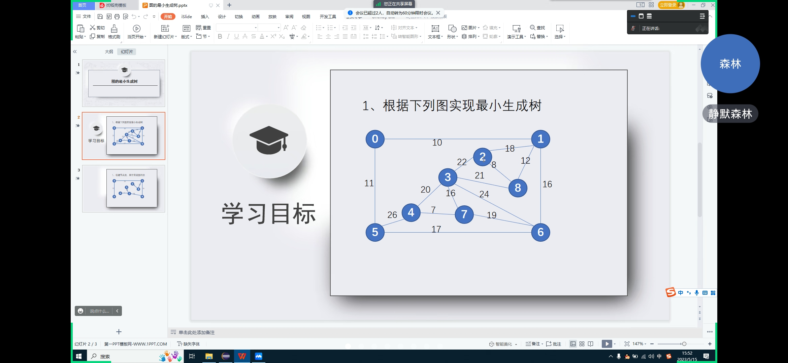
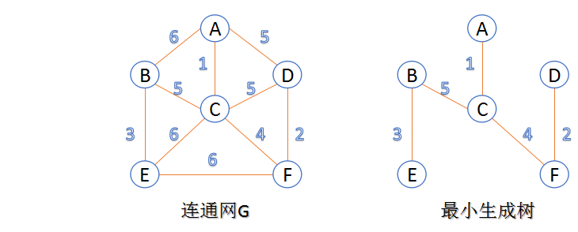

# 测试数据

### 数据 01



生成代码:

```
graph.addEdge(4, 7, 7);
graph.addEdge(2, 8, 8);
graph.addEdge(0, 1, 10);
graph.addEdge(0, 5, 11);
graph.addEdge(1, 8, 12);
graph.addEdge(3, 7, 16);
graph.addEdge(1, 6, 16);
graph.addEdge(5, 6, 17);
graph.addEdge(1, 2, 18);
graph.addEdge(6, 7, 19);
graph.addEdge(3, 4, 20);
graph.addEdge(3, 8, 21);
graph.addEdge(2, 3, 22);
graph.addEdge(3, 6, 24);
graph.addEdge(4, 5, 26);
```

参考最小生成树:

```
Graph{ (4, 7, 7), (2, 8, 8), (0, 1, 10), (0, 5, 11), (1, 8, 12), (3, 7, 16), (1, 6, 16), (6, 7, 19) }
```

### 数据 02

来源: <https://blog.csdn.net/luoshixian099/article/details/51908175>



生成代码:

```
graph.addEdge(0, 2, 1);
graph.addEdge(3, 5, 2);
graph.addEdge(1, 4, 3);
graph.addEdge(2, 5, 4);
graph.addEdge(0, 3, 5);
graph.addEdge(1, 2, 5);
graph.addEdge(2, 3, 5);
graph.addEdge(0, 1, 6);
graph.addEdge(2, 4, 6);
graph.addEdge(4, 5, 6);
```

参考最小生成树:

```
Graph{ (0, 2, 1), (3, 5, 2), (1, 4, 3), (2, 5, 4), (1, 2, 5) }
```